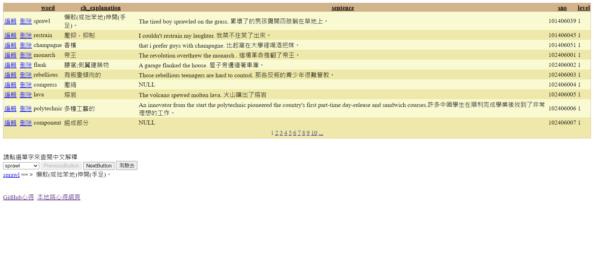
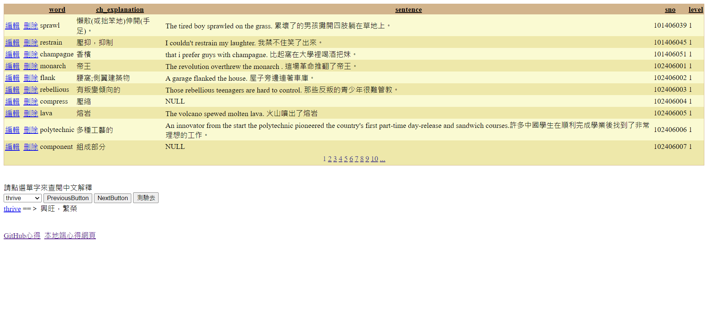
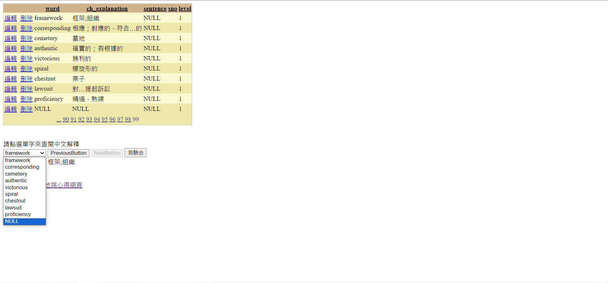

<!DOCTYPE html>
<html>
<head>
    <meta charset="utf-8" />
    <title></title>
</head>
<body>

    <h1>GEPT Words 單字測驗 ASP.NET 程式開發心得</h1>
    作者：CBF110004 何祐霆

    <h2>開發思路與解決方案</h2>
    在這裡，你可以描述你在開發過程中的思考過程，以及你如何解決問題的。
    <h3>開發過程</h3>
    
同下方"遇到的問題"

    <h3>解決策略</h3>
    
同下方"解決的方法

    <h2>使用的技術與引用來源</h2>
    在這裡，你可以列出你在開發過程中使用到的技術，以及你參考的資料來源。
    <h3>使用的技術</h3>
    
SQL OFFSET FETCH子句、Fisher-Yates Shuffle

    <h3>引用的資源</h3>
    <a href="https://www.yiibai.com/sqlserver/sql-server-offset-fetch.html" target="_blank">SQL OFFSET FETCH子句</a>
    <a href="https://elearning.nptu.edu.tw/base/10001/course/10046282/content/week8/index.html">洗牌演算法</a>

    <h2>遇到的問題與解決方法</h2>
    在這裡，你可以分享你在開發過程中遇到的問題，以及你是如何解決這些問題的。
    <h3>遇到的問題</h3>
    

        1.DDL在按下PreviousButton及NextButton後，DDL無法顯示換頁部分 
        2.假設最後一頁有10筆資料，NextButton並不會無法按下 
    

    <h3>解決的方法</h3>
    

        1.使用SqlDataSource1.SelectCommand重新撰寫一個SQL的SELECT語法(使用OFFSET FETCH子句)，然後再使用DDL1.DataBind()重新繫結回去  
        2.新增變數，用以判斷總比數是否=DDL顯示出的筆數 
    

    <h2>修改後的程式內容</h2>
    在這裡，你可以分享你修改後的程式碼，並解釋你做了哪些改變。
    <h3>修改的部分</h3>
    

        於資料繫結後 先計算出資料之總比數，並使用(!IsPostBack) 
        <pre>
        if (!IsPostBack)
        {
            for (int i = 0; i < CBF110004_GV1.PageCount; i++)
            {
                allcount = (int)Session["allcount"];
                allcount += CBF110004_GV1.Rows.Count;
                Session["allcount"] = allcount;
                CBF110004_GV1.PageIndex++;
            }
            CBF110004_GV1.PageIndex = 0;
        }
        </pre>

    

    <h3>程式碼說明</h3>
    
allcount為一int變數，用以儲存全部的資料計數，並使用Session儲存。

    <h2>程式執行畫面</h2>
    在這裡，你可以分享你的程式執行畫面，並解釋每個畫面的功能。
    

         
        👆上圖演示了預設會跑出來的樣子 
         
        👆上圖演示了按下NextButton時會換到下10筆資料，且PreviousButton會被啟用的樣子 
         
        👆上圖演示了在最後一頁時，NextButton會被禁用會的樣子 
         
        👆上圖演示了按下測驗鈕時的樣子 
    

    <h3>功能介紹</h3>
    
如下影片所示，就不一一介紹功能了。

    <h3>畫面展示</h3>
    

        <iframe width="560" height="315" src="https://www.youtube.com/embed/2If6WGwB71s?si=9iVgwVrauYKW34Mf" title="YouTube video player" frameborder="0" allow="accelerometer; autoplay; clipboard-write; encrypted-media; gyroscope; picture-in-picture; web-share" allowfullscreen></iframe>
    

    <h2>個人心得與反思</h2>
    在這裡，你可以分享你對於這次開發經驗的感想，以及你從中學到了什麼。
    <h3>學習心得</h3>
    
我對資料繫結的部分越來越熟悉了，對程式的熟悉度提高了。我知道了資料該如何重新使用DataBind()繫結回去。

    <h3>未來展望</h3>
    
希望我的程式能力更加精進。

</body>
</html>
